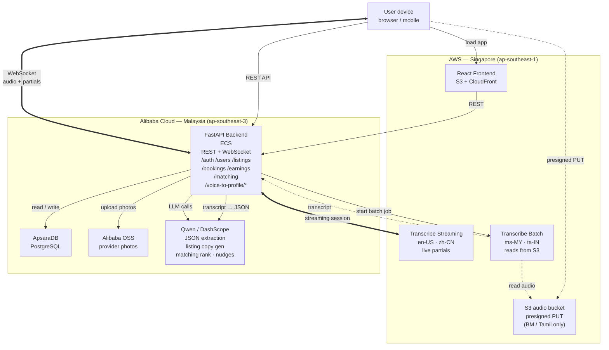

# Multi-Cloud Architecture

AWS owns the user-facing edge and AI services that handle audio/eKYC. Alibaba Cloud owns the application and data plane (backend, Postgres, provider media, Qwen).

The voice-to-profile pipeline has two paths depending on language:
- **Streaming** for `en-US` and `zh-CN` — live partial transcripts, ~2-3s end-to-end after the user stops speaking.
- **Batch** for `ms-MY` (Bahasa Malaysia) and `ta-IN` (Tamil) — Transcribe Streaming does not support these languages, so they go through batch ASR (~8-12s).

## Diagram



## Voice-to-Profile flow — streaming (en-US, zh-CN)

1. Browser opens a WebSocket to `wss://<backend>/voice-to-profile/stream` with `{language}`.
2. Backend opens an AWS Transcribe Streaming session via the `amazon-transcribe` Python SDK.
3. Browser streams 16kHz PCM audio chunks over the WebSocket as the user speaks.
4. Backend forwards chunks to Transcribe; partial transcripts flow back to the browser live for caption UX.
5. When the user stops speaking, Transcribe emits the final transcript.
6. Backend sends the final transcript to Qwen with the JSON extraction prompt (see below).
7. Backend persists the listing draft to Postgres and returns the structured JSON to the browser.

End-to-end target: **2-3 seconds** after the user stops speaking.

## Voice-to-Profile flow — batch (ms-MY, ta-IN)

1. Browser records audio, then requests a presigned S3 PUT URL from the backend.
2. Browser uploads audio directly to S3 in `ap-southeast-1`.
3. Browser calls `POST /voice-to-profile/batch` with `{s3_key, language}`.
4. Backend returns a pending job response immediately and drives Transcribe Batch from a FastAPI background task.
5. Browser polls the status endpoint while the backend waits for the batch transcript.
6. On completion, backend sends the transcript to Qwen with the same JSON extraction prompt.
7. Backend persists the listing draft and returns the structured JSON through the status endpoint.

End-to-end target: **8-12 seconds** for a 20-second clip.

## Qwen JSON extraction

Single prompt for both flows. Qwen returns strict JSON via `response_format={"type": "json_object"}`:

```json
{
  "name": "string | null",
  "service_offer": "string",
  "category": "home_cooking | traditional_crafts | pet_sitting | household_help | other",
  "price_amount": "number | null",
  "price_unit": "per_meal | per_hour | per_day | per_month | null",
  "capacity": "number | null",
  "dietary_tags": ["halal", "vegetarian", "..."],
  "location_hint": "string | null",
  "language": "ms-MY | en-US | zh-CN | ta-IN"
}
```

Free-text fields (`service_offer`, `location_hint`) preserve the original language. Enum fields are normalized to canonical English values regardless of input language.

## Service responsibilities

| Cloud | Service | Role |
|---|---|---|
| AWS | S3 + CloudFront | React frontend hosting (KL/Cyberjaya edge POP) |
| AWS | S3 (audio bucket) | Audio ingest for batch path (BM, Tamil) |
| AWS | Transcribe Streaming | Live ASR for en-US, zh-CN |
| AWS | Transcribe Batch | Async ASR for ms-MY, ta-IN |
| Alibaba | ECS | FastAPI backend (REST + WebSocket) |
| Alibaba | ApsaraDB PostgreSQL | Primary relational data |
| Alibaba | OSS | Provider photo storage |
| Alibaba | Qwen / DashScope | JSON extraction, listing copy generation, matching ranking, earnings nudges |

## Notes

- **Why two paths:** AWS Transcribe Streaming supports en-US and zh-CN but not ms-MY or ta-IN. Rather than batch-everything (slow) or drop multilingual support (kills the pitch), the architecture routes by language code at the API boundary.
- **Entity extraction is Qwen-only.** AWS Comprehend was dropped — its built-in entity types don't map to domain concepts (cuisines, dietary tags, capacity), and Qwen handles all four languages with structured JSON output natively.
- **No Tair/Redis in v1.** Cache infrastructure was dropped as overkill for the hackathon demo; Postgres remains the source of truth and the backend queries it directly.
- **Backend is the WebSocket proxy** rather than browser-direct to Transcribe — avoids shipping AWS credentials to the browser and gives one place to log + switch streaming↔batch by language.
- **Cross-region latency** SG ↔ KL is ~10-15ms RTT, negligible compared to ASR processing time.
