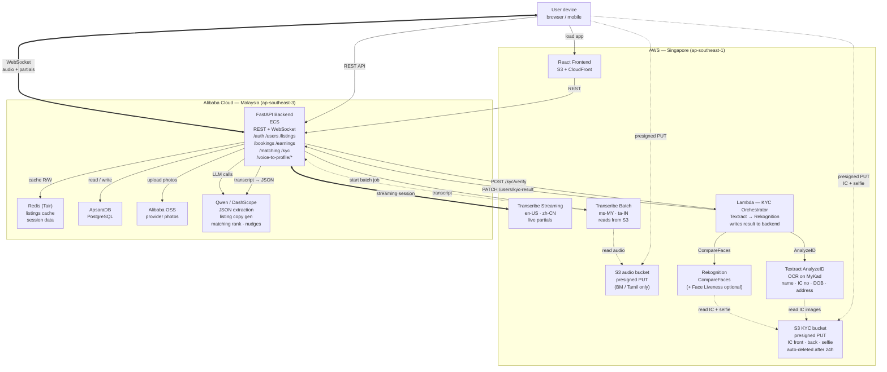

# Multi-Cloud Architecture

AWS owns the user-facing edge (frontend, ASR, and eKYC). Alibaba Cloud owns the data plane and generative AI (backend, database, cache, media, Qwen).

The voice-to-profile pipeline has two paths depending on language:
- **Streaming** for `en-US` and `zh-CN` — live partial transcripts, ~2-3s end-to-end after the user stops speaking.
- **Batch** for `ms-MY` (Bahasa Malaysia) and `ta-IN` (Tamil) — Transcribe Streaming does not support these languages, so they go through batch ASR (~8-12s).

The eKYC pipeline runs entirely within AWS so that PII (IC images, selfie) never crosses to Alibaba infrastructure.

## Diagram



## eKYC flow (elder onboarding)

Applies to the **elder role only** at sign-up. Required before the elder can receive payments.

1. Frontend calls `POST /kyc/session` on the backend.
2. Backend creates a KYC session record in Postgres and returns **presigned S3 PUT URLs** (one each for IC front, IC back, selfie). URLs are valid for 15 minutes.
3. Browser uploads files **directly to S3** using the presigned URLs — images never pass through the backend server.
4. Frontend calls `POST /kyc/verify` with `{ sessionId }`.
5. Backend triggers the **KYC Lambda** asynchronously.
6. Lambda runs in sequence:
   - **Textract AnalyzeID** on IC front + back → extracts `fullName`, `icNumber`, `dateOfBirth`, `address`, `nationality`, `gender`, confidence score.
   - **Rekognition CompareFaces** → compares the face on the IC with the selfie, returns similarity score.
   - *(Optional)* **Rekognition Face Liveness** → checks the selfie is a live person, not a printed photo.
7. Lambda writes the result (`approved` / `failed` / `manual_review`) back to the backend via `PATCH /users/{userId}/kyc-result`.
8. Frontend polls `GET /kyc/status/{jobId}` every 2.5s until a terminal status is returned.
9. On `approved`, the extracted data is shown to the elder for confirmation before the account is activated.

End-to-end target: **10-20 seconds** (Textract + Rekognition each take ~3-5s for a clean image).

**Why Lambda, not backend-direct:**
- IC images and selfie stay inside AWS — they never cross to Alibaba infrastructure.
- Textract and Rekognition run in `ap-southeast-1`; Lambda in the same region means zero cross-cloud latency for PII.
- S3 lifecycle policy auto-deletes KYC images after 24h — backend never has access to raw images.
- Failed KYC Lambda does not affect backend uptime.

**KYC status values:** `not_started` → `pending` → `approved` | `failed` | `manual_review`

## Voice-to-Profile flow — streaming (en-US, zh-CN)

1. Browser opens a WebSocket to `wss://<backend>/voice-to-profile/stream` with `{language}`.
2. Backend opens an `amazon-transcribe-streaming` session to AWS via boto3.
3. Browser streams 16kHz PCM audio chunks over the WebSocket as the user speaks.
4. Backend forwards chunks to Transcribe; partial transcripts flow back to the browser live for caption UX.
5. When the user stops speaking, Transcribe emits the final transcript.
6. Backend sends the final transcript to Qwen with the JSON extraction prompt (see below).
7. Backend persists the listing draft to Postgres and returns the structured JSON to the browser.

End-to-end target: **2-3 seconds** after the user stops speaking.

## Voice-to-Profile flow — batch (ms-MY, ta-IN)

1. Browser records audio, then requests a presigned S3 PUT URL from the backend.
2. Browser uploads audio directly to S3 in `ap-southeast-1`.
3. Browser calls `POST /voice-to-profile/batch` with `{s3_key, language}`.
4. Backend submits a Transcribe batch job pointing at the S3 URI and polls inline (~1.5s interval).
5. On completion, backend sends the transcript to Qwen with the same JSON extraction prompt.
6. Backend persists the listing draft and returns the structured JSON to the browser.

End-to-end target: **8-12 seconds** for a 20-second clip.

## Qwen JSON extraction

Single prompt for both flows. Qwen returns strict JSON via `response_format={"type": "json_object"}`:

```json
{
  "name": "string | null",
  "service_offer": "string",
  "category": "home_cooking | traditional_crafts | pet_sitting | household_help | other",
  "price_amount": "number | null",
  "price_unit": "per_meal | per_hour | per_day | per_month | null",
  "capacity": "number | null",
  "dietary_tags": ["halal", "vegetarian", "..."],
  "location_hint": "string | null",
  "language": "ms-MY | en-US | zh-CN | ta-IN"
}
```

Free-text fields (`service_offer`, `location_hint`) preserve the original language. Enum fields are normalized to canonical English values regardless of input language.

## Service responsibilities

| Cloud | Service | Role |
|---|---|---|
| AWS | S3 + CloudFront | React frontend hosting (KL/Cyberjaya edge POP) |
| AWS | S3 (audio bucket) | Audio ingest for batch ASR path (BM, Tamil) |
| AWS | S3 (KYC bucket) | IC images + selfie — 24h auto-delete lifecycle |
| AWS | Transcribe Streaming | Live ASR for en-US, zh-CN |
| AWS | Transcribe Batch | Async ASR for ms-MY, ta-IN |
| AWS | Textract (AnalyzeID) | OCR on MyKad — name, IC number, DOB, address |
| AWS | Rekognition (CompareFaces) | Face match between IC photo and selfie |
| AWS | Rekognition Face Liveness | Liveness check — prevents photo spoofing (optional) |
| AWS | Lambda (KYC Orchestrator) | Orchestrates Textract → Rekognition → writes result to backend |
| Alibaba | ECS | FastAPI backend (REST + WebSocket) |
| Alibaba | ApsaraDB PostgreSQL | Primary relational data |
| Alibaba | Tair (Redis) | Listings cache + session data |
| Alibaba | OSS | Provider photo storage |
| Alibaba | Qwen / DashScope | JSON extraction, listing copy generation, matching ranking, earnings nudges |

## Notes

- **Why two paths (voice):** AWS Transcribe Streaming supports en-US and zh-CN but not ms-MY or ta-IN. Rather than batch-everything (slow) or drop multilingual support (kills the pitch), the architecture routes by language code at the API boundary.
- **Entity extraction is Qwen-only.** AWS Comprehend was dropped — its built-in entity types don't map to domain concepts (cuisines, dietary tags, capacity), and Qwen handles all four languages with structured JSON output natively.
- **Redis is a read-through cache,** not a job queue — used for listing browse, search results, and session lookups to keep the demo snappy.
- **Backend is the WebSocket proxy** rather than browser-direct to Transcribe — avoids shipping AWS credentials to the browser and gives one place to log + switch streaming↔batch by language.
- **Cross-region latency** SG ↔ KL is ~10-15ms RTT, negligible compared to ASR processing time.
- **eKYC PII isolation:** Raw IC images and selfies are processed and stored only within AWS (`ap-southeast-1`). The Alibaba backend only ever receives the extracted text fields and a pass/fail status — never the images themselves.
